# Mermaid examples — all in one

Every diagram from this directory on a single page. See the per-diagram
files for grammar notes. Preview with `make build && ./mdp serve
docs/examples/all.md`.

## Flowchart (ELK default — compare with `dagre = true`)

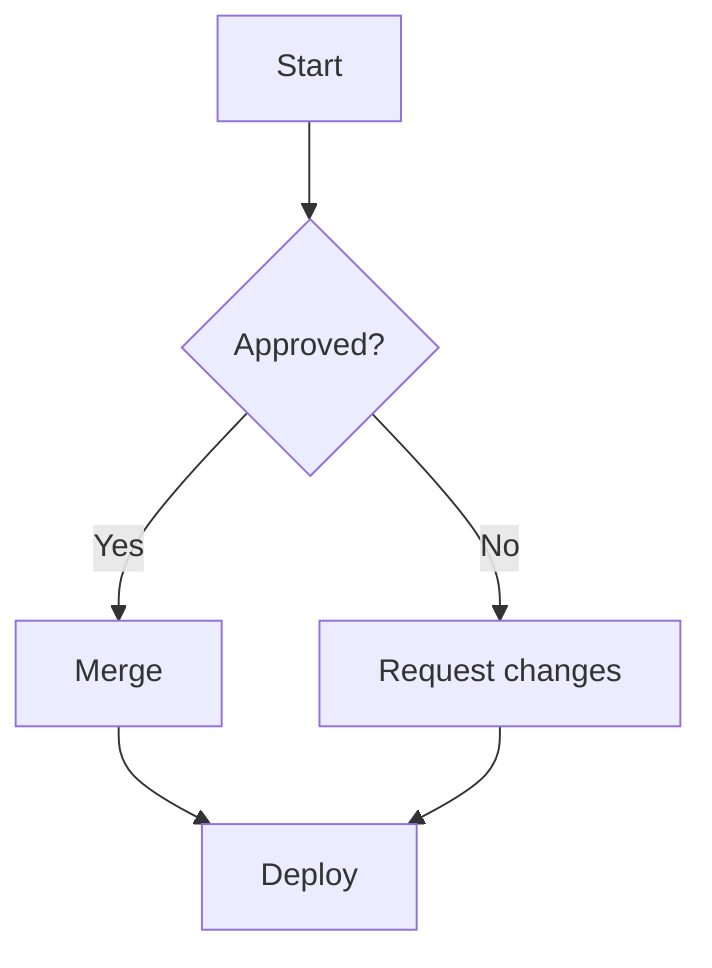

## Sequence

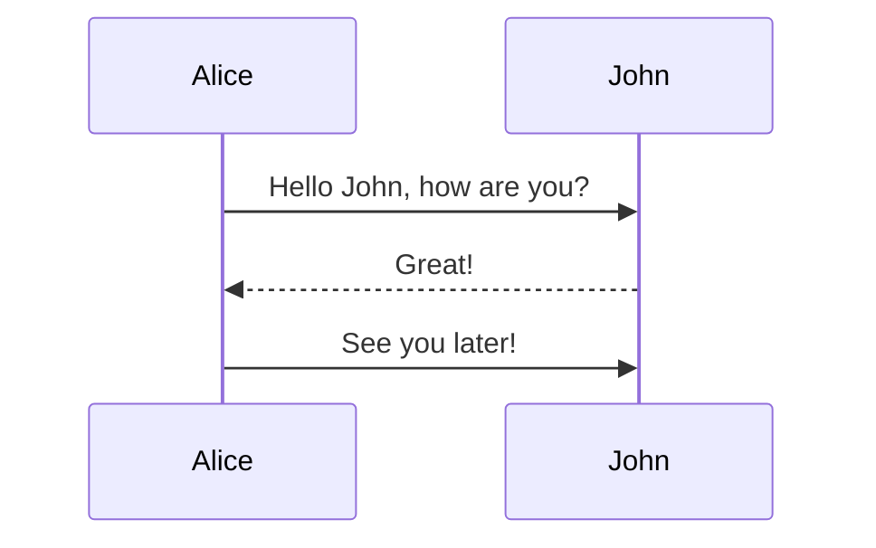

## State

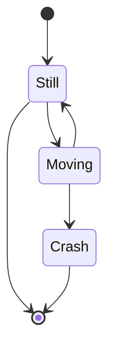

## Use case (v12 `usecase-beta`)

```mermaid
usecase-beta
direction LR
actor Customer
actor Admin
systemBoundary Shop[Online Shop]
Browse(Browse Catalog)
Checkout(Checkout)
Manage[Manage Inventory]
end
Customer --> Browse
Customer --> Checkout
Admin --> Manage
```

## Agentflow-beta (v12, beta syntax)

```mermaid
agentflow-beta TB
  flow reviewer["Review Agent"]
    changes["Gather changes"]@{ shape: input }
    analyse["Analyse"]@{ shape: task }
    lint["run_linter"]@{ shape: tool }
    spec["API spec"]@{ shape: refdoc }
    decide["Ship it?"]@{ shape: decision }
    changes --> analyse --> lint --> decide
    analyse -.- spec
    decide --x|needs work| analyse
  end
```

## Kanban

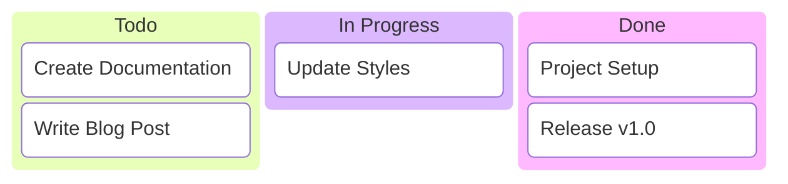

## Timeline

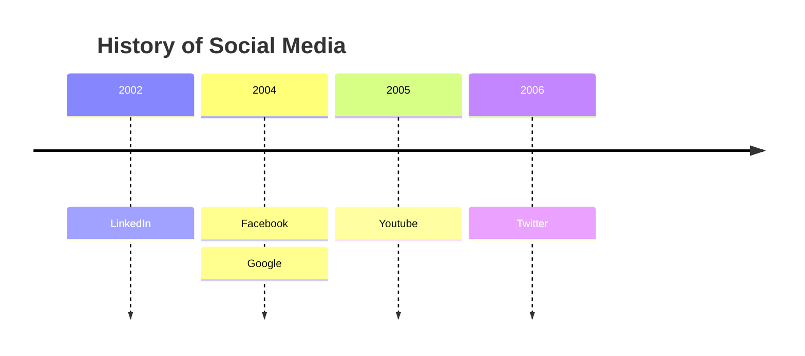

## Git graph

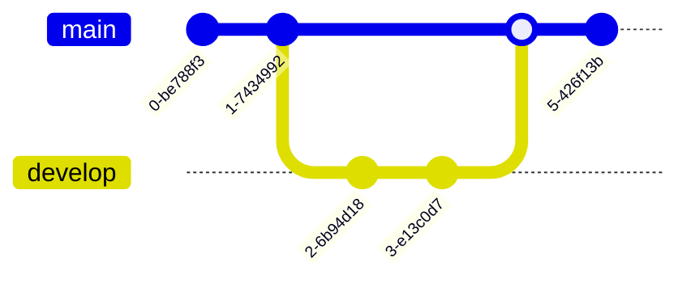

## AWS web service (built-in icons)

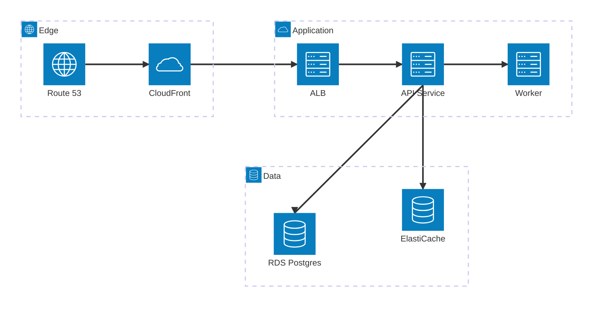

## AWS web service (Iconify `logos:` icons, needs network)

```mermaid
architecture-beta
group edge(internet)[Edge]
group app(cloud)[Application]
group data(database)[Data]
service dns(logos:aws-route53)[Route 53] in edge
service cdn(logos:aws-cloudfront)[CloudFront] in edge
service alb(logos:aws-elb)[ALB] in app
service api(logos:aws-ecs)[ECS Service] in app
service worker(logos:aws-lambda)[Worker] in app
service db(logos:aws-rds)[RDS Postgres] in data
service cache(logos:aws-elasticache)[ElastiCache] in data
dns:R --> L:cdn
cdn:R --> L:alb
alb:R --> L:api
api:B --> T:db
api:B --> T:cache
api:R --> L:worker
```

## AWS EKS (built-in icons)

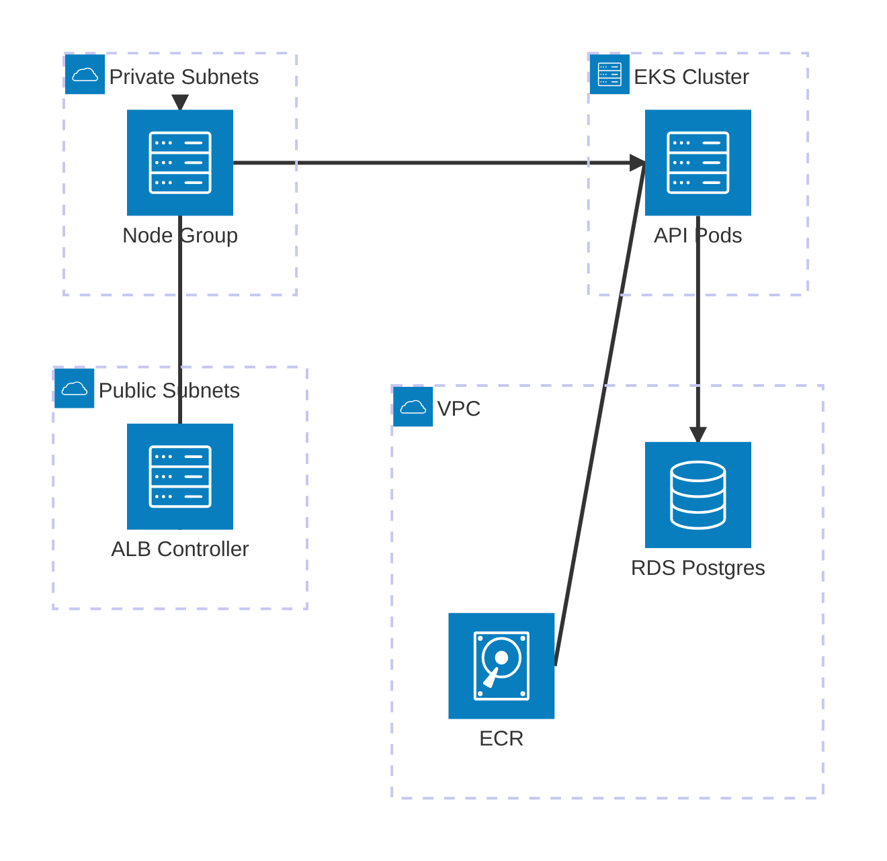

## AWS EKS (Iconify icons, needs network)

```mermaid
architecture-beta
group vpc(logos:aws-vpc)[VPC]
group public(cloud)[Public Subnets]
group private(cloud)[Private Subnets]
group cluster(logos:aws-eks)[EKS Cluster]
service alb(logos:aws-elb)[ALB Controller] in public
service nodes(logos:aws-ec2)[Node Group] in private
service pods(logos:kubernetes)[API Pods] in cluster
service registry(devicon:docker)[Container Images] in vpc
service db(devicon:postgresql)[RDS Postgres] in vpc
alb:B --> T:nodes
nodes:R --> L:pods
registry:R --> L:pods
pods:B --> T:db
```

## ER — e-commerce Postgres

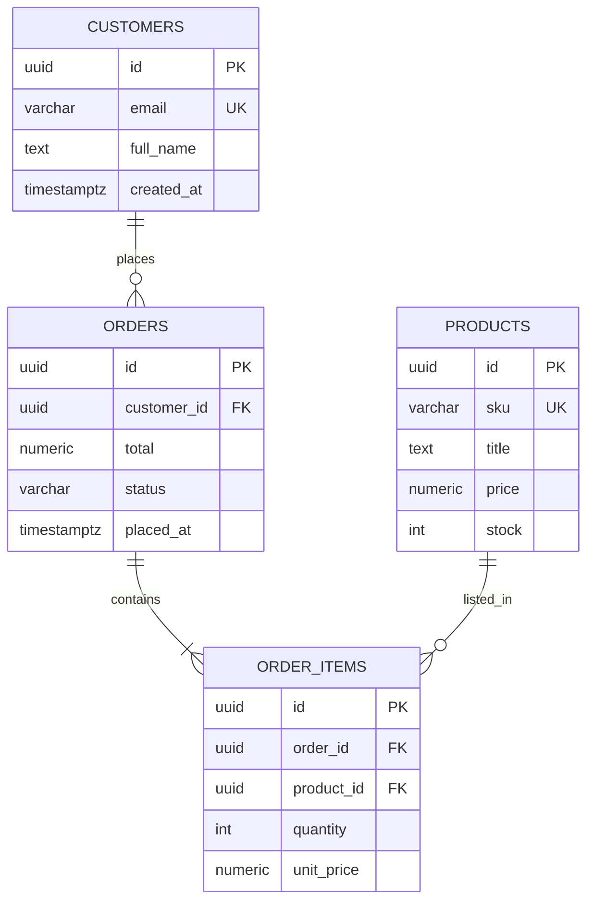

## ER — docs CMS

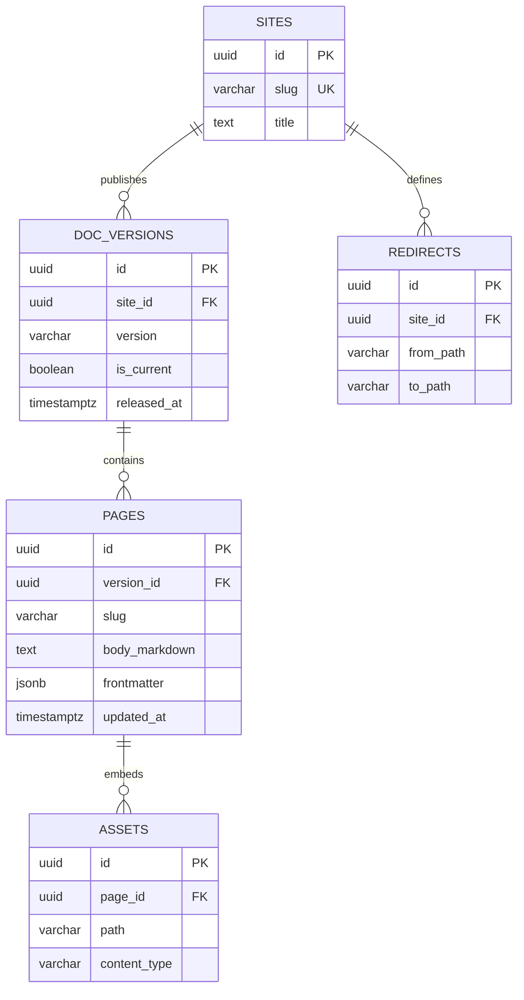

## Class diagram — mdp server core

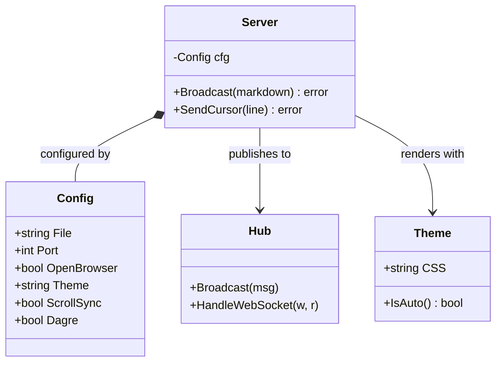

## Requirements — mdp preview

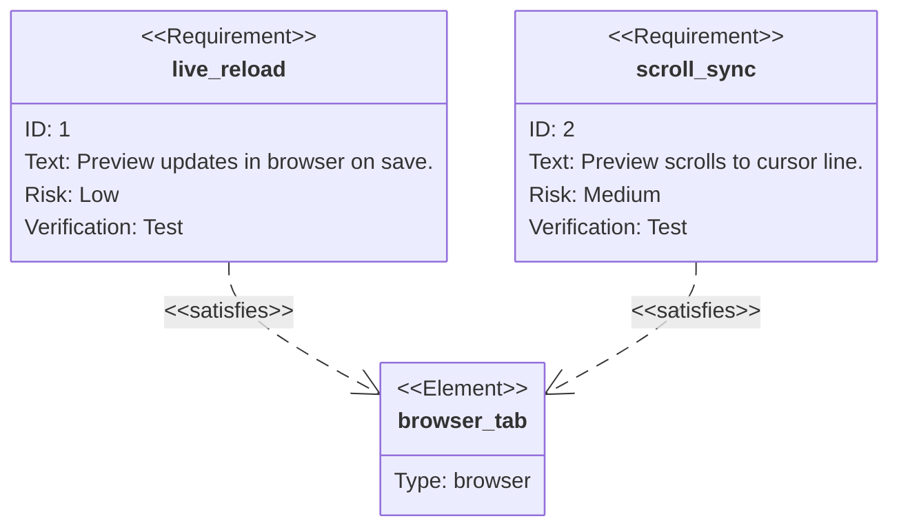
