# AWS web service architecture (Iconify icons)

Same topology as `architecture-aws.md` but with real service icons via
`pack:icon` references. mdp registers the `logos` and `devicon` packs with
CDN loaders by default — packs download lazily in the browser on first use,
so this needs network at view time; offline it falls back to generic glyphs.

```mermaid
architecture-beta
group edge(internet)[Edge]
group app(cloud)[Application]
group data(database)[Data]
service dns(logos:aws-route53)[Route 53] in edge
service cdn(logos:aws-cloudfront)[CloudFront] in edge
service alb(logos:aws-elb)[ALB] in app
service api(logos:aws-ecs)[ECS Service] in app
service worker(logos:aws-lambda)[Worker] in app
service db(logos:aws-rds)[RDS Postgres] in data
service cache(logos:aws-elasticache)[ElastiCache] in data
dns:R --> L:cdn
cdn:R --> L:alb
alb:R --> L:api
api:B --> T:db
api:B --> T:cache
api:R --> L:worker
```

