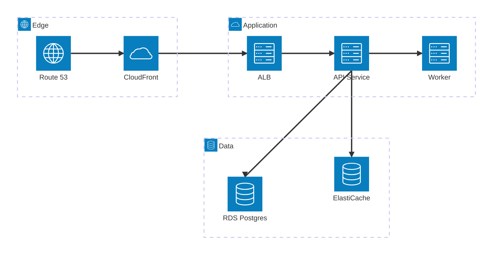

# AWS web service architecture (built-in icons)

`architecture-beta` syntax: `service id(icon)[Title] in group`,
edges pin sides (`a:R --> L:b`). Built-in icons only:
`cloud`, `database`, `disk`, `internet`, `server`. See
`architecture-aws-icons.md` for the Iconify-pack version.

