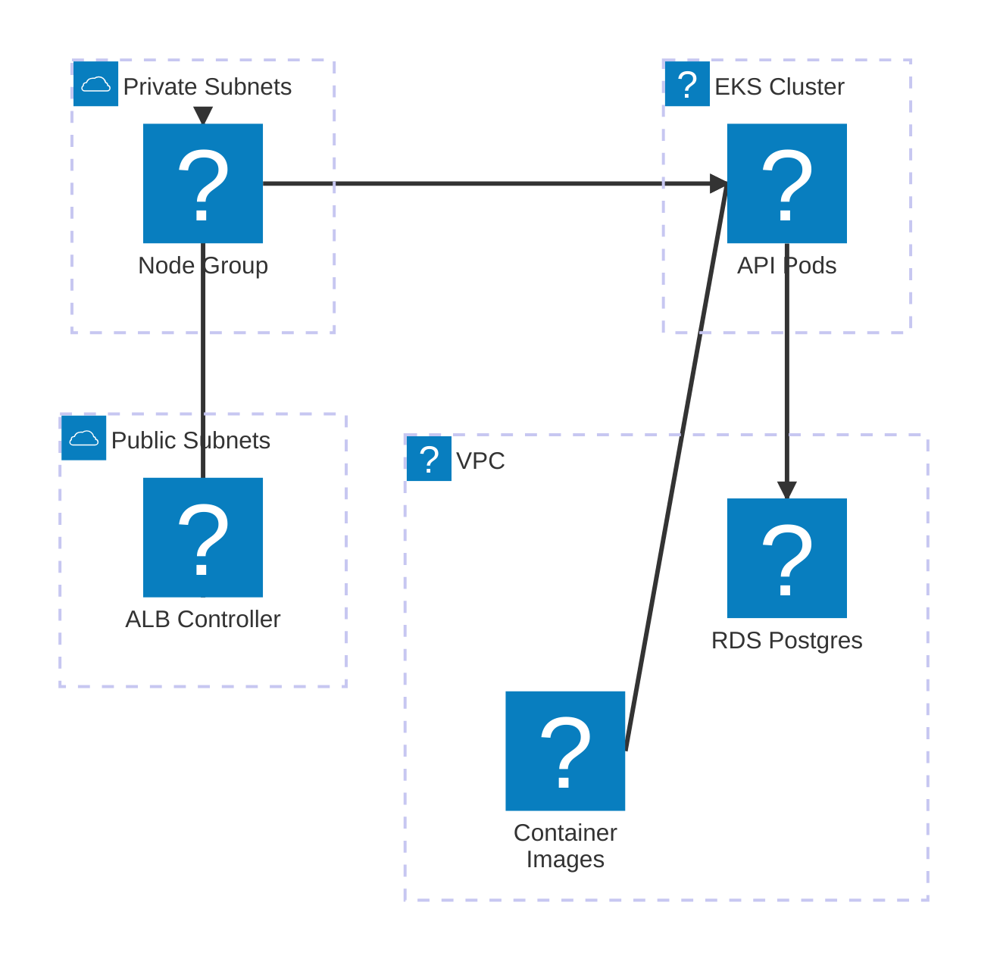

# AWS EKS architecture (Iconify icons)

Same topology as `architecture-eks.md` with `logos:` / `devicon:` service
icons. Needs network at view time (packs fetch lazily from CDN).

```mermaid
architecture-beta
group vpc(logos:aws-vpc)[VPC]
group public(cloud)[Public Subnets]
group private(cloud)[Private Subnets]
group cluster(logos:aws-eks)[EKS Cluster]
service alb(logos:aws-elb)[ALB Controller] in public
service nodes(logos:aws-ec2)[Node Group] in private
service pods(logos:kubernetes)[API Pods] in cluster
service registry(devicon:docker)[Container Images] in vpc
service db(devicon:postgresql)[RDS Postgres] in vpc
alb:B --> T:nodes
nodes:R --> L:pods
registry:R --> L:pods
pods:B --> T:db
```
