# AWS EKS architecture (official Kubernetes icons)

Same topology as `architecture-eks.md` but with the official `k8s` pack
("Kubernetes Icons" by The Kubernetes Authors: `pod`, `deployment`,
`service`, `secret`, `ingress`, `configmap`, `namespace`, …). Needs network
at view time (pack fetches lazily from CDN).

```mermaid
architecture-beta
group cluster(cloud)[EKS Cluster]
service deploy(k8s:deployment)[API Deployment] in cluster
service pods(k8s:pod)[API Pods] in cluster
service svc(k8s:service)[ClusterIP] in cluster
service secrets(k8s:secret)[App Secrets] in cluster
service ingress(k8s:ingress)[Ingress] in cluster
ingress:B --> T:svc
svc:R --> L:deploy
deploy:R --> L:pods
deploy:B --> T:secrets
```

