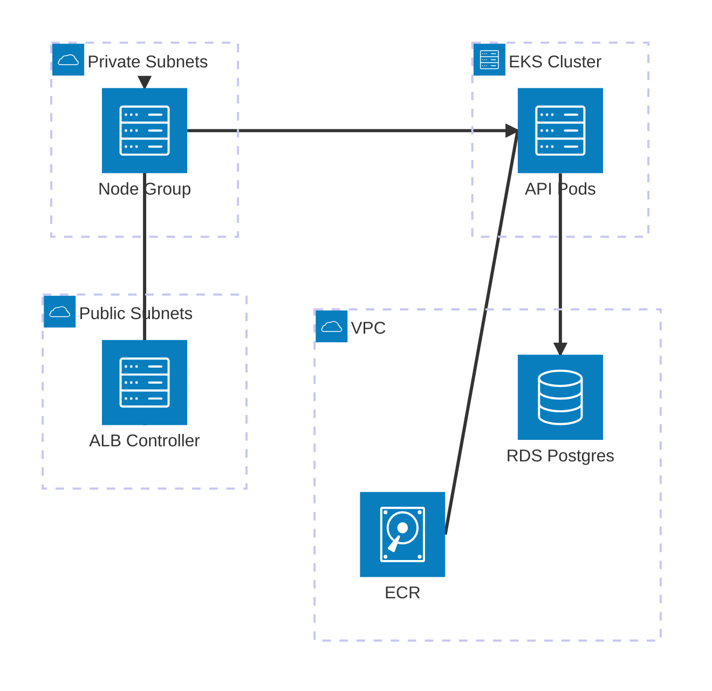

# AWS EKS architecture (built-in icons)

```mermaid
architecture-beta
group vpc(cloud)[VPC]
group public(cloud)[Public Subnets]
group private(cloud)[Private Subnets]
group cluster(server)[EKS Cluster]
service alb(server)[ALB Controller] in public
service nodes(server)[Node Group] in private
service pods(server)[API Pods] in cluster
service registry(disk)[ECR] in vpc
service db(database)[RDS Postgres] in vpc
alb:B --> T:nodes
nodes:R --> L:pods
registry:R --> L:pods
pods:B --> T:db
```
