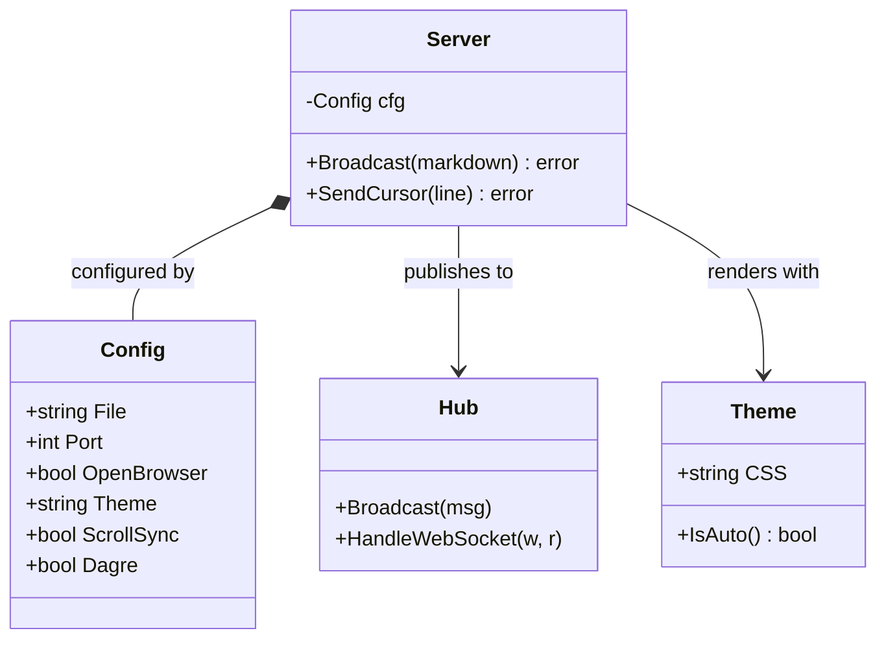

# Class diagram — mdp's own server core

Modeled on the real structs in `internal/server` (`Config`, `Server`) and
`pkg/livereload` (`Hub`), plus `pkg/theme` (`Theme`). Member types stay
bracket-free since `[`/`]` collide with mermaid syntax.

