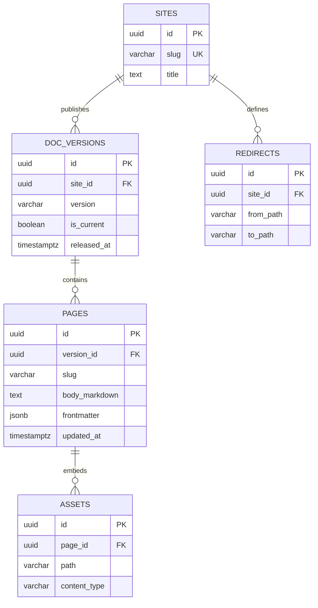

# ER diagram — docs CMS schema (sites, versions, pages, assets, redirects)

```mermaid
erDiagram
SITES ||--o{ DOC_VERSIONS : publishes
DOC_VERSIONS ||--o{ PAGES : contains
PAGES ||--o{ ASSETS : embeds
SITES ||--o{ REDIRECTS : defines
SITES {
    uuid id PK
    varchar slug UK
    text title
}
DOC_VERSIONS {
    uuid id PK
    uuid site_id FK
    varchar version
    boolean is_current
    timestamptz released_at
}
PAGES {
    uuid id PK
    uuid version_id FK
    varchar slug
    text body_markdown
    jsonb frontmatter
    timestamptz updated_at
}
ASSETS {
    uuid id PK
    uuid page_id FK
    varchar path
    varchar content_type
}
REDIRECTS {
    uuid id PK
    uuid site_id FK
    varchar from_path
    varchar to_path
}
```
