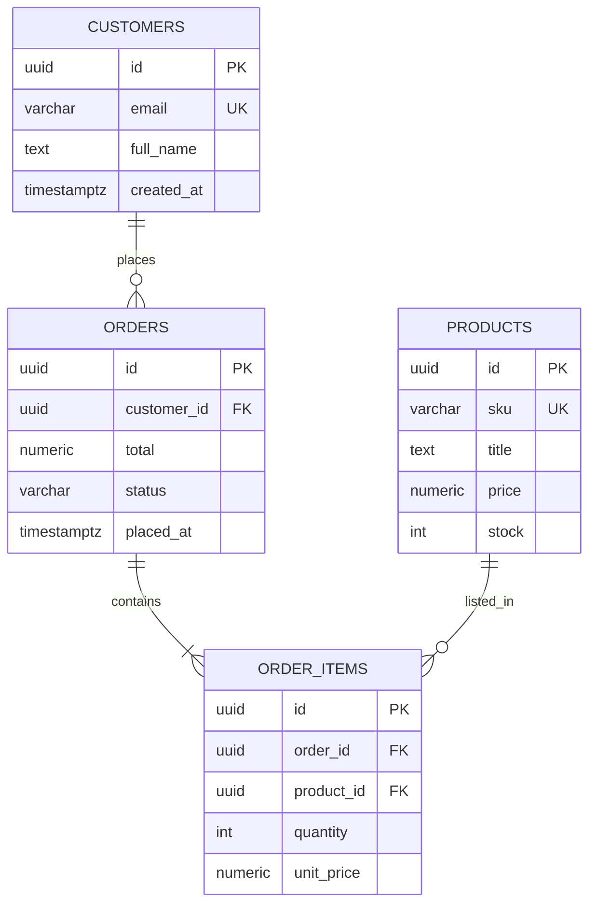

# ER diagram — e-commerce Postgres schema

```mermaid
erDiagram
CUSTOMERS ||--o{ ORDERS : places
ORDERS ||--|{ ORDER_ITEMS : contains
PRODUCTS ||--o{ ORDER_ITEMS : listed_in
CUSTOMERS {
    uuid id PK
    varchar email UK
    text full_name
    timestamptz created_at
}
ORDERS {
    uuid id PK
    uuid customer_id FK
    numeric total
    varchar status
    timestamptz placed_at
}
PRODUCTS {
    uuid id PK
    varchar sku UK
    text title
    numeric price
    int stock
}
ORDER_ITEMS {
    uuid id PK
    uuid order_id FK
    uuid product_id FK
    int quantity
    numeric unit_price
}
```
