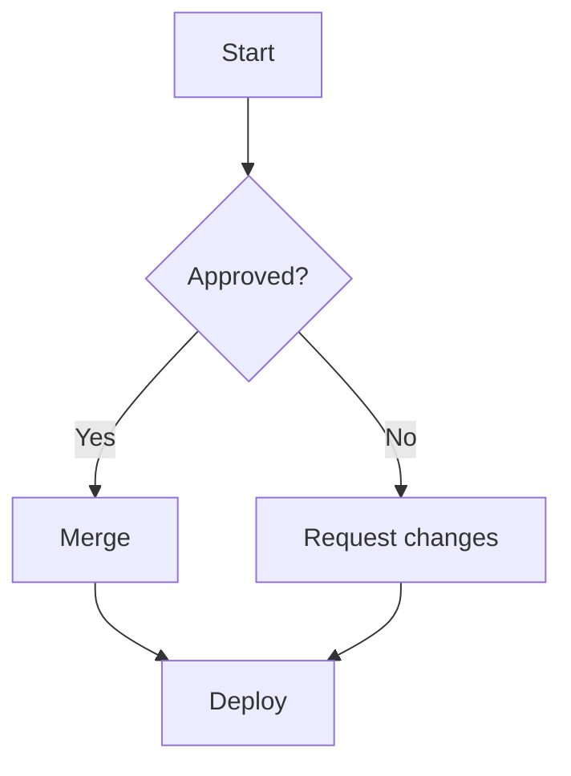

# Flowchart

ELK is the default layout in Mermaid v12. Compare with the dagre escape
hatch (`dagre = true` plugin opt / `mdp serve --dagre`).

`linkStyle 1 stroke:success` / `linkStyle 2 stroke:danger` use mdp's
status colour names (`danger`, `success`, `warning`, `accent`), which
follow the theme; the arrowhead takes the edge colour. Nodes take the
same names as classes: `class D danger`.

