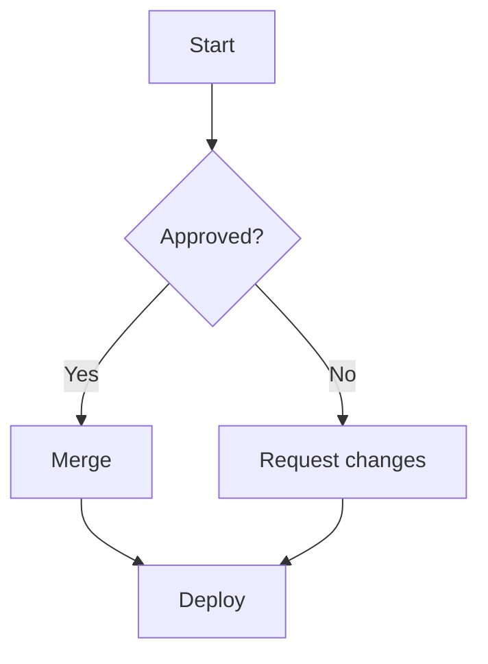

# Flowchart

ELK is the default layout in Mermaid v12. Compare with the dagre escape
hatch (`dagre = true` plugin opt / `mdp serve --dagre`).

`class C success` / `class D danger` use mdp's semantic node classes
(`danger`, `success`, `warning`, `accent`), coloured from the theme with
no `classDef` needed.

