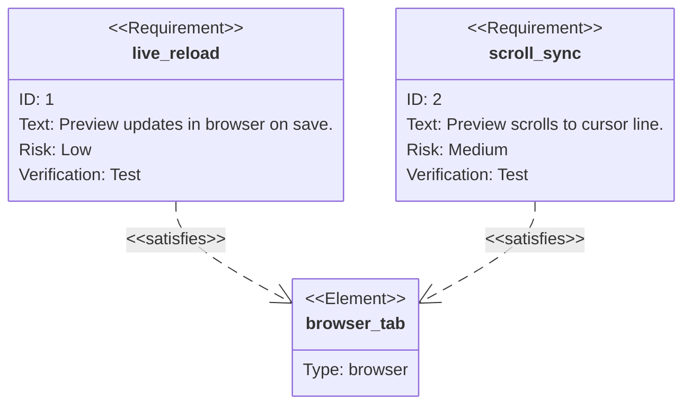

# Requirement diagram — mdp preview requirements

```mermaid
requirementDiagram
requirement live_reload {
id: 1
text: Preview updates in browser on save.
risk: low
verifymethod: test
}
requirement scroll_sync {
id: 2
text: Preview scrolls to cursor line.
risk: medium
verifymethod: test
}
element browser_tab {
type: browser
}
live_reload - satisfies -> browser_tab
scroll_sync - satisfies -> browser_tab
```
