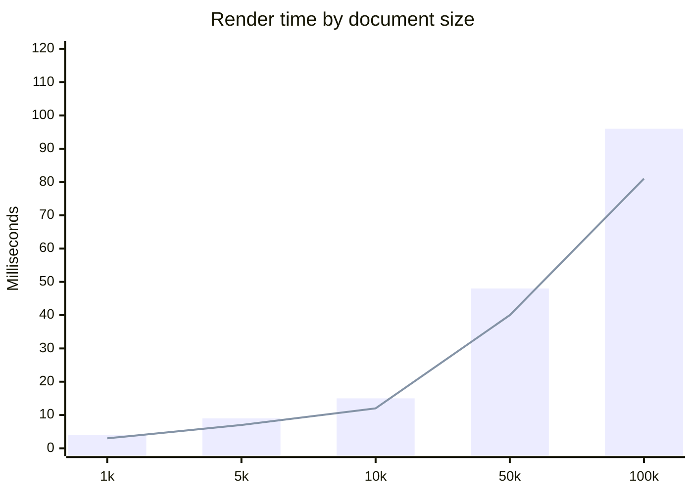

# XY chart

```mermaid
xychart-beta
    title "Render time by document size"
    x-axis [1k, 5k, 10k, 50k, 100k]
    y-axis "Milliseconds" 0 --> 120
    bar [4, 9, 15, 48, 96]
    line [3, 7, 12, 40, 81]
```
