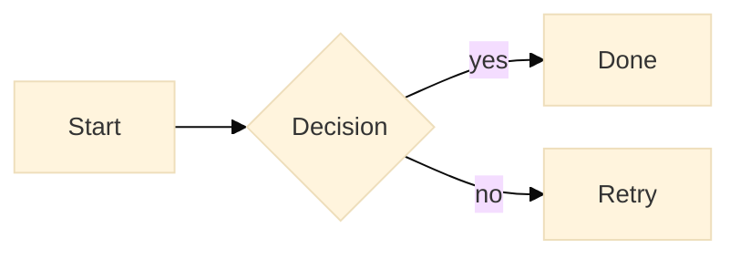

<!-- markdownlint-disable-file MD025 MD041 -->

# INV-0004: Evaluate beautiful-mermaid for diagram rendering and ASCII output

<!--toc:start-->
- [Question](#question)
- [Hypothesis](#hypothesis)
- [Context](#context)
- [Approach](#approach)
- [Environment](#environment)
- [Findings](#findings)
  - [Observation 1: What beautiful-mermaid is](#observation-1-what-beautiful-mermaid-is)
  - [Observation 2: Diagram-type coverage against mdp's examples](#observation-2-diagram-type-coverage-against-mdps-examples)
  - [Observation 3: Distribution format and real client payload](#observation-3-distribution-format-and-real-client-payload)
  - [Observation 4: Theme model and how it maps onto mdp's themes](#observation-4-theme-model-and-how-it-maps-onto-mdps-themes)
  - [Observation 5: Text measurement and fonts](#observation-5-text-measurement-and-fonts)
  - [Observation 6: ASCII rendering, client-side and server-side](#observation-6-ascii-rendering-client-side-and-server-side)
  - [Observation 7: What a switch would orphan](#observation-7-what-a-switch-would-orphan)
  - [Observation 8: Where it plugs into mdp's pipeline](#observation-8-where-it-plugs-into-mdps-pipeline)
  - [Observation 9: Mermaid v12's own styling surface](#observation-9-mermaid-v12s-own-styling-surface)
- [Conclusion](#conclusion)
- [Recommendation](#recommendation)
- [Decisions](#decisions)
- [Open Questions](#open-questions)
- [References](#references)
<!--toc:end-->

## Question

Can mdp render Mermaid diagrams with [beautiful-mermaid](https://github.com/lukilabs/beautiful-mermaid)
(the renderer behind <https://agents.craft.do/mermaid>) so that diagrams
pick up the look of the built-in themes — Tokyo Night in particular — and
offer an ASCII / Unicode box-drawing render mode, **without** regressing
the diagram types, layout controls, and icon packs mdp ships today?

## Hypothesis

- **Aesthetics and theming: yes.** beautiful-mermaid ships a Tokyo Night
  palette and exposes colors as CSS custom properties, so matching mdp's
  themes should be a mapping exercise rather than new CSS.
- **Coverage: no, not fully.** beautiful-mermaid is an independent
  implementation, not a mermaid.js skin, so it will support a subset of
  diagram types. Some of mdp's `docs/examples` will not render with it.
- **ASCII: yes, client-side.** The package exposes an ASCII renderer
  directly, so the preview can call it without a Go-side dependency.
- **Payload: smaller.** Expected a meaningful reduction against the
  5.4 MB vendored `mermaid.min.js`.

## Context

Mermaid diagrams in the preview currently use stock mermaid.js v12 styled
through twelve `--mermaid-*` custom properties per theme (see the Theme
CSS Format in `CLAUDE.md`). The result is functional but visibly "stock
Mermaid". beautiful-mermaid produces the cleaner, monochrome-with-accent
look seen on the Craft demo page and also emits box-drawing ASCII, which
would be a distinctive feature for a terminal-editor preview tool.

Two recent changes constrain any move: #82 made ELK the default layout
with a `--dagre` escape hatch, and #83 registered Iconify packs for
`architecture-beta` diagrams and added `docs/examples/` as the diagram
regression corpus. Whatever is adopted must keep those examples rendering.

**Triggered by:** user request on branch `docs/ui-updates` after reviewing
<https://agents.craft.do/mermaid>. Related: PR #82, PR #83,
`pkg/parser.WithMermaidRenderMode`.

## Approach

1. Inventory beautiful-mermaid from the npm registry, jsDelivr, and the
   GitHub source: API surface, supported diagram types, theme model,
   published module format, and dependencies.
2. Inventory mdp's Mermaid pipeline: `pkg/parser` options,
   `assets/preview.js` / `preview.html`, `internal/server` template data,
   the `--mermaid-*` theme properties, and the `update-vendor` Makefile
   target.
3. Cross-check the diagram types used by `docs/examples/*.md` against
   beautiful-mermaid's parser to size the coverage gap.
4. Measure the real client payload: the published bundle plus its
   external dependencies, versus the vendored `mermaid.min.js`.
5. Evaluate ASCII options: the client-side `renderMermaidASCII` API, and
   the Go project it was ported from (`mermaid-ascii`) as a server-side
   alternative, including a throwaway-module probe of its dependency
   footprint and exported API.
6. Map beautiful-mermaid's color slots onto mdp's existing `--color-*`
   properties and compare against its built-in palettes for the themes
   both projects share.

## Environment

| Component | Version / Value |
| --------- | --------------- |
| mdp | v0.5.0 (`main` at `d45c7b3`), branch `docs/ui-updates` |
| Go | 1.26.8 (`go.mod`) |
| Vendored `mermaid.min.js` | 12.0.0, 5,448 KB (ELK inlined by Mermaid v12) |
| `go.abhg.dev/goldmark/mermaid` | v0.6.0 |
| beautiful-mermaid | 1.1.3 on npm (published 2026-02-26), MIT, ESM only |
| elkjs (beautiful-mermaid dependency) | 0.11.0 |
| entities (beautiful-mermaid dependency) | 7.0.1 |
| mermaid-ascii (Go) | tag `1.6.1` (2026-09-08); resolves as pseudo-version `v0.0.0-20260908213847-5f00e3d9ac9f` because tags lack the `v` prefix |
| Local JS toolchain (dev machine only) | node 24.14.0, bun 1.3.14, esbuild 0.28.1; none pinned in `mise.toml`, `update-vendor` is curl-only |

## Findings

### Observation 1: What beautiful-mermaid is

beautiful-mermaid is a from-scratch TypeScript implementation of a Mermaid
subset — its own parser, its own SVG renderer, and layout via ELK.js. It
does **not** wrap or depend on mermaid.js. Public API (from
`src/index.ts` and `dist/index.d.ts`):

| Export | Notes |
| ------ | ----- |
| `renderMermaidSVG(text, opts): string` | **Synchronous.** ELK's FakeWorker is patched so layout runs inline (`src/elk-instance.ts`). |
| `renderMermaidSVGAsync(text, opts)` | Same output, promise-wrapped. |
| `renderMermaidASCII(text, opts): string` | Box-drawing or plain-ASCII text output. |
| `parseMermaid(text): MermaidGraph` | Throws `Invalid mermaid header: …` on unsupported diagram types. |
| `THEMES`, `fromShikiTheme`, `DEFAULTS` | 15 named palettes; Shiki theme adapter. |

Render options (README table): `bg`, `fg` (required foundation), optional
`line`, `accent`, `muted`, `surface`, `border`, plus `font` (default
`Inter`), `transparent`, `padding`, `nodeSpacing`, `layerSpacing`,
`componentSpacing`, `thoroughness` (ELK crossing-minimisation trials),
`interactive`. Every color option accepts a hex value **or a CSS variable
string**; colors are emitted as custom properties on the `<svg>` element
(`--bg`, `--fg`, `--line`, `--accent`, `--muted`, `--surface`, `--border`)
so a theme change restyles an already-rendered diagram with no re-render.

### Observation 2: Diagram-type coverage against mdp's examples

beautiful-mermaid's parser accepts exactly six headers: `flowchart` /
`graph`, `stateDiagram-v2`, `sequenceDiagram`, `classDiagram`,
`erDiagram`, and `xychart-beta`. `docs/examples/` (added in #83, validated
with `mermaid.parse()`) exercises twelve types:

| Type used in `docs/examples` | beautiful-mermaid | Notes |
| ---------------------------- | ----------------- | ----- |
| flowchart / graph | supported | |
| sequenceDiagram | supported | |
| classDiagram | supported | |
| stateDiagram-v2 | supported | |
| erDiagram | supported | |
| architecture-beta | **unsupported** | 10 uses; the entire point of #83's Iconify packs |
| usecase-beta | **unsupported** | |
| agentflow-beta | **unsupported** | |
| timeline | **unsupported** | |
| kanban | **unsupported** | |
| gitGraph | **unsupported** | |
| requirementDiagram | **unsupported** | |

Five of twelve types render; seven do not, including the most-used one.
A wholesale replacement of mermaid.js is therefore off the table. The
failure mode is clean and deterministic — `parseMermaid` throws before
any DOM work — so a hybrid renderer can try beautiful-mermaid first and
hand the block to `mermaid.run()` on `catch`.

### Observation 3: Distribution format and real client payload

The npm tarball ships only `dist/index.js` (ESM, 327.7 KB unminified),
`dist/index.d.ts`, and a source map. `tsup.config.ts` marks `elkjs` and
`entities` as `external`, and the published file still contains bare
imports:

```js
import { decodeXML } from "entities";
import ELKBundled from "elkjs/lib/elk.bundled.js";
```

There is **no browser-global build in the package**. `src/browser.ts`
exists but is a demo-only entry that hangs functions off
`window.__mermaid` for the repo's `samples.html`; it is built ad hoc with
`Bun.build` and not published. mdp cannot vendor `dist/index.js` with a
plain `<script>` tag the way it vendors `mermaid.min.js`; a bundling step
(or the jsDelivr `+esm` variant, which rewrites the two imports to
`/npm/...` URLs) is required.

Real client payload, measured from jsDelivr:

| Asset | Size |
| ----- | ---- |
| `beautiful-mermaid@1.1.3/+esm` (minified, deps external) | 155 KB |
| `elkjs@0.11.0/lib/elk.bundled.js` | 1,589 KB |
| `entities@7.0.1` (ESM dist) | ~87 KB |
| **Total beautiful-mermaid path** | **~1.8 MB** |
| `assets/vendor/mermaid.min.js` (v12, ELK inlined) | 5,448 KB |

So the honest comparison is roughly **3× smaller**, not the 16× the bare
`dist/index.js` number suggests — ELK dominates both. In a hybrid design
the preview would load **both** engines (~7.3 MB of embedded JS instead
of 5.4 MB) unless mermaid.js is loaded lazily only when an unsupported
type is encountered.

The ASCII path is lighter: `src/ascii/index.ts` imports only the parser
and the ASCII modules, never ELK. A tree-shaken ASCII-only bundle would
be small, but that again requires a bundler; the single published entry
cannot be split by hand.

### Observation 4: Theme model and how it maps onto mdp's themes

beautiful-mermaid ships 15 palettes: `zinc-light`, `zinc-dark`,
`tokyo-night`, `tokyo-night-storm`, `tokyo-night-light`,
`catppuccin-mocha`, `catppuccin-latte`, `nord`, `nord-light`, `dracula`,
`github-light`, `github-dark`, `solarized-light`, `solarized-dark`,
`one-dark`. mdp registers 15 themes. Overlap:

| mdp theme | beautiful-mermaid palette |
| --------- | ------------------------- |
| tokyo-night, tokyo-night-storm | exact name match |
| tokyo-night-day | `tokyo-night-light` (same upstream palette, different name) |
| github-light, github-dark | exact name match |
| catppuccin-latte, catppuccin-mocha | exact name match |
| tokyo-night-moon, catppuccin-frappe, catppuccin-macchiato, github-dimmed, rose-pine, rose-pine-moon, rose-pine-dawn, donald | no counterpart |

Seven of fifteen have a ready-made palette; eight need a derived one.
mdp's existing prose properties map naturally onto the seven color
slots:

| beautiful-mermaid slot | mdp property |
| ---------------------- | ------------ |
| `bg` | `--color-canvas-default` |
| `fg` | `--color-fg-default` |
| `muted` | `--color-fg-muted` |
| `accent` | `--color-accent-fg` |
| `border` | `--color-border-default` |
| `surface` | `--color-canvas-subtle` |
| `line` | `--color-border-default` (no direct equivalent) |

Checking that derivation against upstream's hand-tuned values for the
shared themes shows where it drifts:

| Theme / slot | upstream palette | derived from mdp `--color-*` |
| ------------ | ---------------- | ---------------------------- |
| tokyo-night `bg` / `fg` | `#1a1b26` / `#a9b1d6` | `#1a1b26` / `#c0caf5` (mdp's `fg-muted` is `#a9b1d6`) |
| tokyo-night `accent` | `#7aa2f7` | `#7aa2f7` |
| tokyo-night `muted` | `#565f89` | `#a9b1d6` |
| tokyo-night `line` | `#3d59a1` | `#29293d` (upstream uses a distinctly brighter blue for edges) |
| github-dark `accent` | `#4493f8` | `#58a6ff` |
| github-dark `line` / `muted` | `#3d444d` / `#9198a1` | `#30363d` / `#8b949e` |
| github-light `accent` | `#0969da` | `#0969da` |
| catppuccin-mocha `accent` | `#cba6f7` (mauve) | `#89b4fa` (blue) |
| catppuccin-mocha `line` | `#585b70` | `#313244` |

`bg` and `fg` land exactly everywhere; `accent`, `line`, and `muted`
diverge on several themes. To get the look on the Craft page for Tokyo
Night specifically, the diagram palette needs its own values rather
than a pure derivation from prose colors. This mirrors the existing
convention where each theme file already carries dedicated
`--mermaid-*` properties.

### Observation 5: Text measurement and fonts

beautiful-mermaid runs without a DOM (Bun / Node / browser alike), so it
cannot measure text with `canvas.measureText`. `src/text-metrics.ts`
estimates widths from character-class buckets tuned for Inter, and the
SVG carries `font` (default `Inter`). mdp's preview body uses the
system-UI stack (`-apple-system, BlinkMacSystemFont, "Segoe UI", …`,
`assets/preview.css:64`). If mdp passes a different font, labels may be
slightly over- or under-sized relative to their boxes; mermaid.js does not
have this class of issue because it measures in the live DOM. This is a
visual-verification item, not a blocker.

### Observation 6: ASCII rendering, client-side and server-side

**Client-side.** `renderMermaidASCII(text, opts)` supports flowchart,
sequence, class, ER, and XY chart (not state). `AsciiRenderOptions`:

```ts
useAscii?: boolean          // true = + - | > ; false (default) = ┌ ─ │ ►
paddingX?: number           // default 5
paddingY?: number           // default 5
boxBorderPadding?: number   // default 1
colorMode?: 'none' | 'auto' | 'ansi16' | 'ansi256' | 'truecolor' | 'html'
theme?: Partial<AsciiTheme> // via diagramColorsToAsciiTheme(colors)
```

`colorMode: 'html'` emits `<span style="color:…">` runs, so the output
drops straight into a `<pre>` and can be themed with the same color slots
as the SVG path. No ELK involvement.

**Server-side.** The ASCII engine is a port of
[mermaid-ascii](https://github.com/AlexanderGrooff/mermaid-ascii) (Go,
MIT, actively released — 1.6.1 on 2026-09-08). Its README documents only
the CLI, but the packages under `pkg/` are importable. A throwaway-module
probe shows:

```go
// github.com/AlexanderGrooff/mermaid-ascii/pkg/render
func RenderDiagram(input string, config *diagram.Config) (string, error)
func RenderDiagramWithStatus(input string, config *diagram.Config) (string, WidthStatus, error)
func DiagramFactory(input string) (diagram.Diagram, error)

// github.com/AlexanderGrooff/mermaid-ascii/pkg/diagram
type Config struct {
    UseAscii, ShowCoords, Verbose bool
    BoxBorderPadding, PaddingBetweenX, PaddingBetweenY, MaxWidth int
    GraphDirection string // "LR" | "TD"
    StyleType      string // "cli" | "html"
}
```

Importing `pkg/render` pulls in `logrus`, `gookit/color`,
`mattn/go-runewidth`, `elliotchance/orderedmap/v2`, `clipperhouse/uax29`,
`xo/terminfo`, and `golang.org/x/sys` — no gin or cobra, which stay in
the CLI module. Costs: an undocumented library surface, a pseudo-version
dependency (tags are not `v`-prefixed), and coverage limited to
flowchart / sequence / ER (no class or XY chart).

The goldmark hook for a server-side path exists: `goldmark-mermaid`
exports `mermaid.Kind` and `mermaid.Block`, so a custom `NodeRenderer`
can emit `<pre class="mermaid-ascii">…</pre>` at parse time. The
`Compiler` interface (`CompileRequest{Source}` → `CompileResponse{SVG}`)
is SVG-only and is not the right seam for text output.

### Observation 7: What a switch would orphan

| Feature | Effect under beautiful-mermaid |
| ------- | ------------------------------ |
| `--dagre` (#82) | Meaningless. beautiful-mermaid is ELK-only; its knobs are `thoroughness` and the spacing options. Still valid for the mermaid.js fallback path. |
| Iconify packs (#83) | Unused. Only `architecture-beta` consumes them, and that type falls back to mermaid.js anyway. |
| `--mermaid-*` theme properties (12 per theme) | Unused by beautiful-mermaid; still required by the fallback path. |
| `data-mermaid-theme` / `data-mermaid-layout` body attributes | Fallback path only. |
| `pkg/parser` public API | Unaffected for a client-side design: the parser keeps emitting `<pre class="mermaid">`. A server-side ASCII path would add a `With…` option. |

### Observation 8: Where it plugs into mdp's pipeline

`renderClientSide()` in `assets/preview.js` clears `data-processed` on
`.mermaid` nodes and calls `mermaid.run({ nodes })`. A hybrid would walk
the same nodes first:

```js
for (const node of content.querySelectorAll(".mermaid")) {
  try {
    node.innerHTML = renderMermaidSVG(node.textContent, {
      bg: "var(--diagram-bg)", fg: "var(--diagram-fg)", /* … */
      transparent: true,
    });
    node.dataset.processed = "true";     // keep mermaid.run() off it
  } catch (_) { /* unsupported type: leave for mermaid.run() */ }
}
mermaid.run({ nodes: content.querySelectorAll(".mermaid:not([data-processed])") });
```

Because the SVG call is synchronous and colors are CSS variables, there
is no async re-init dance and theme switching is free. Because the
published module is ESM, `preview.html` would load it with
`<script type="module">` (or an IIFE produced by the bundling step),
and `data-source-line` annotations on the `<pre>` wrapper are untouched,
so scroll sync is unaffected.

### Observation 9: Mermaid v12's own styling surface

Added 2026-09-22 after the decision to pursue the theme route first
(see [Decisions](#decisions)).

**What mdp renders today.** `preview.js` calls
`mermaid.initialize({ theme: "base", themeVariables: {…} })` with twelve
color variables and sets nothing else. Mermaid 12 introduced a `look`
setting (`classic`, `handDrawn`, `neo`) and six new themes (`neo`,
`neo-dark`, `redux`, `redux-dark`, `redux-color`, `redux-dark-color`), and
lets both be set per diagram type. Resolution order, highest first:
diagram front matter, `initialize()`, the diagram type's own default, the
global default. The vendored bundle's per-type defaults are
`theme: "redux-color", look: "neo"` for flowchart, sequence, class, state,
ER, requirement, use case, agentflow, and swimlane. Consequences:

- `theme: "base"` from `initialize()` outranks the per-type
  `redux-color`, so colors do come from the `--mermaid-*` variables.
- `look` is never set, so those diagram types render with the **neo
  look**, not classic.
- Under neo, base's `useGradient: true` paints node strokes with a
  gradient (turned off only by setting `nodeBorder` or
  `useGradient: false`), and base's `dropShadow` applies. Neo also pads
  rectangles 28×24 px versus classic's `flowchart.padding` of 15.
- Typography is untouched: base's `fontFamily` is
  `"trebuchet ms", verdana, arial` at `16px`, and sequence diagrams add
  their own `actorFontFamily` (`"Open Sans"`) and `messageFontFamily`
  defaults. None of the twelve variables mdp sets is a font.

The gradient strokes, the shadow, and Trebuchet at 16 px are the bulk of
what reads as "stock Mermaid". Each is a single-variable fix.

**Trait-by-trait mapping.** beautiful-mermaid's `src/styles.ts` pins the
numbers behind the Craft look. Each has a mermaid.js counterpart:

| Trait | beautiful-mermaid | mermaid.js control (current mdp value) |
| ----- | ----------------- | -------------------------------------- |
| Font | Inter; 13 px node labels (weight 500), 11 px edge labels, 12 px group headers (600); JetBrains Mono for class members | `fontFamily`, `fontSize`, `fontWeight` theme variables (Trebuchet, 16 px); sequence `actorFontFamily` / `messageFontFamily` / `noteFontFamily` config |
| Strokes | 1 px outer box, 0.75 px inner, 1 px connectors, flat color | `strokeWidth` (base: 1); `useGradient: false` or set `nodeBorder` (gradient on today) |
| Corners | rounded | `radius` (base 5, neo theme 3, redux 12) |
| Shadow | none | `dropShadow` (base sets one; verify `none` under the neo look, whose stylesheet references a shadow filter) |
| Node fill / border | `surface` tint, `border` stroke | `nodeBkg`, `mainBkg`, `nodeBorder`, `clusterBkg`, `clusterBorder` |
| Edges | 1 px `line`, 8×5 px arrowheads in `accent` | `lineColor`, `defaultLinkColor`, `arrowheadColor`; marker geometry is not a variable, so size needs `themeCSS` |
| Edge labels | `muted`, background = canvas | `edgeLabelBackground`, `textColor`; sequence `signalColor`, `signalTextColor`, `labelBoxBkgColor` |
| Spacing | node padding 20×10, `nodeSpacing` 24, `layerSpacing` 40 | `flowchart.padding` (15), `flowchart.nodeSpacing` (50), `flowchart.rankSpacing` (50), `flowchart.diagramPadding` (8) |
| Layout | ELK | ELK already the default since #82 |

The base theme accepts 224 variables in total (`themes/theme-base.js`),
with dedicated slots for sequence (`actorBkg`, `actorBorder`,
`actorLineColor`, `signalColor`, `activationBkgColor`, …), class
(`classText`), state (`transitionColor`, `stateBkg`,
`compositeBackground`, …), ER (`attributeBackgroundColorOdd` / `Even`),
requirement (`requirementBackground`, `relationColor`), git graph, and
more. Anything a variable does not reach goes through `config.themeCSS`,
which mermaid injects inside its own id-scoped `<style>` block
(`mermaidAPI.ts`, `createUserStyles`), so it wins where page CSS in
`preview.css` cannot.

**Foundation choice.** The new `neo` / `neo-dark` themes default to
`strokeWidth` 2 / 1, `radius` 3, Arial 14 px, with gradient and shadow
on, so they sit further from the target than `base` does. Keeping
`theme: "base"` and adding variables is the shorter path.

**Zero-code spike.** Mermaid reads a `config:` front-matter block inside
the diagram text at the highest-priority layer, and only six keys
(`secure`, `securityLevel`, `startOnLoad`, `maxTextSize`,
`suppressErrorRendering`, `maxEdges`) are blocked from diagram-level
config. Verified that `pkg/parser` passes the fence body through
verbatim, front matter included, so all of this can be tried in a
markdown file with the current binary:

````markdown

````

**Coverage.** Because this is still mermaid.js, the skin applies to all
twelve diagram types in `docs/examples`, including `architecture-beta`,
and leaves #82 and #83 untouched.

## Conclusion

**Answer:** Yes, with limits — and it is not the cheapest way to get the
look.

- Adopting beautiful-mermaid as **the** renderer is not viable: it covers
  five of the twelve diagram types in `docs/examples` and none of the
  `architecture-beta` diagrams #83 was built for.
- Adopting it as a **first-choice renderer with mermaid.js fallback** is
  viable but expensive: a bundling step the repo does not have, two
  engines in the binary (~7.3 MB of JS instead of 5.4 MB), a theme
  mapping layer, and a fallback path to maintain.
- **The look itself is reachable with mermaid.js alone.** mdp currently
  renders in Mermaid 12's `neo` look with gradient strokes, a drop
  shadow, and Trebuchet at 16 px because it sets only color variables
  (Observation 9). Font, stroke, radius, shadow, spacing, and the missing
  color slots are all theme variables or config, and `themeCSS` covers
  the rest. That path applies to all twelve diagram types and needs no
  new dependency.
- **ASCII output is the one thing only beautiful-mermaid offers**, and it
  is feasible client-side later (Observation 6) without the SVG path.

## Recommendation

1. **Run the zero-code spike** from Observation 9 on
   `docs/examples/flowchart.md`, `sequence.md`, and `class.md` under
   tokyo-night and github-light, comparing `look: classic` against
   `look: neo` with the gradient and shadow off. Screenshots settle open
   question 1.
2. **Write a DESIGN doc for a Mermaid diagram skin through theme
   variables:** `preview.js` sets the skin-wide config (`look`,
   `fontFamily` read from the computed body style, `fontSize`, spacing,
   `useGradient: false`, `dropShadow`, `themeCSS`); each theme CSS file
   gains the extra `--mermaid-*` color slots that map beautiful-mermaid's
   `surface` / `border` / `line` / `accent` / `muted` model, seeded from
   its `THEMES` values for the seven overlapping themes; the Theme CSS
   Format section of `CLAUDE.md` is updated; verification is
   `docs/examples/all.md` screenshots across four themes.
3. **Keep #82 and #83 behaviour intact.** Nothing in the theme route
   touches `--dagre` or the Iconify packs.
4. **Defer beautiful-mermaid entirely.** Track the ASCII idea in a GitHub
   issue that links Observations 3 and 6 so the research is not lost.

## Decisions

- **2026-09-22 — Theme route first.** Restyle mermaid.js through theme
  variables and config rather than adopting beautiful-mermaid. Cheaper,
  covers all twelve diagram types, no bundling step, no second engine.
- **2026-09-22 — ASCII output deferred.** Not in scope for the theme
  work. The original nine open questions (adoption shape, ASCII
  placement and selection, theme wiring, vendoring, `--dagre`, font,
  keeping mermaid.js, ASCII outside the preview) are superseded by these
  two decisions and preserved in git history at commit `8bc4f92`.

## Open Questions

These are inputs to the DESIGN doc. Each lists **a** as my
recommendation and **b…** as alternatives. Write your choice (or
"other: …") next to each.

**1. Which `look` is the starting point?**

- **a.** `classic` with `theme: base`. Its geometry is flat 1 px strokes
  with no gradient or shadow definitions, which is what the Craft look
  is made of; padding is tuned with `flowchart.padding`.
- **b.** `neo` with `useGradient: false` and `dropShadow: none`. Keeps
  v12's larger node padding and the per-type defaults, at the cost of
  overriding the two effects on every theme and verifying the shadow
  filter really goes away.
- Other:

**2. Where do the non-color settings live?**

- **a.** In `preview.js`, once, for all themes: `look`, `fontFamily` read
  from the computed body style so it tracks `preview.css`, `fontSize`,
  spacing, gradient and shadow off, `themeCSS`. Typography and geometry
  are properties of the skin, not the palette, and theme CSS files stay
  color-only as the Theme CSS Format describes.
- **b.** As additional `--mermaid-*` custom properties per theme file so
  themes can differ in geometry too. More flexible, fifteen files to
  keep in sync.
- Other:

**3. How far does the per-theme color set grow?**

- **a.** Add the slots that map beautiful-mermaid's seven-color model
  onto mermaid variables — `nodeBkg` / `mainBkg` (surface), `nodeBorder`
  / `clusterBorder` (border), `lineColor` / `defaultLinkColor` /
  `signalColor` (line), `arrowheadColor` (accent), edge-label and muted
  text — seeded verbatim from `THEMES` for the seven overlapping themes
  and derived from `--color-*` for the other eight. This is what makes
  tokyo-night match the Craft page.
- **b.** Keep the current twelve colors; fix only typography, gradient,
  shadow, radius, and spacing. Smallest change, but tokyo-night keeps
  its current edge and node colors rather than upstream's.
- Other:

**4. Which font family does the SVG use?**

- **a.** The preview's own stacks: the body stack for labels and the code
  stack for class members, read at runtime. Diagrams match the prose on
  every platform and nothing new is vendored.
- **b.** Vendor Inter and JetBrains Mono and pin them for diagrams only,
  to reproduce the Craft page exactly.
- Other:

**5. How is the deferred ASCII work tracked?**

- **a.** Open a GitHub issue now that links Observations 3 and 6 and the
  beautiful-mermaid API, so the research is not lost.
- **b.** Leave it in this document only.
- Other:

## References

- Craft demo page: <https://agents.craft.do/mermaid>
- Source: <https://github.com/lukilabs/beautiful-mermaid>
  (`src/index.ts`, `src/theme.ts`, `src/ascii/index.ts`,
  `src/elk-instance.ts`, `src/text-metrics.ts`, `src/browser.ts`,
  `tsup.config.ts`)
- npm: <https://www.npmjs.com/package/beautiful-mermaid> (1.1.3; sizes
  measured via `data.jsdelivr.com/v1/package/npm/beautiful-mermaid@1.1.3/flat`
  and `cdn.jsdelivr.net/npm/beautiful-mermaid@1.1.3/+esm`)
- ASCII origin: <https://github.com/AlexanderGrooff/mermaid-ascii>
  (`pkg/render`, `pkg/diagram`)
- goldmark-mermaid v0.6.0: `ast.go` (`Kind`, `Block`),
  `server_render.go` (`Compiler`, `CompileRequest`, `CompileResponse`)
- Mermaid 12.0.0 release notes (per-type `theme` / `look`, resolution
  order, gradient note):
  <https://github.com/mermaid-js/mermaid/releases/tag/mermaid%4012.0.0>
- Mermaid source (`packages/mermaid/src`): `themes/theme-base.js`,
  `themes/theme-neo.js`, `themes/theme-neo-dark.js`,
  `themes/theme-redux-dark.js`, `schemas/config.schema.yaml`,
  `mermaidAPI.ts` (`createUserStyles`, `themeCSS`),
  `rendering-util/insertLookDefs.ts`
- Mermaid front-matter config:
  <https://mermaid.js.org/config/configuration.html#frontmatter-config>
- PR #82 — Mermaid v12 with ELK default and `--dagre`
- PR #83 — Iconify packs and `docs/examples/`
- `assets/preview.js` (Mermaid init / `renderClientSide`),
  `assets/preview.html`, `assets/themes/*.css`, `Makefile`
  (`update-vendor`), `internal/server/server.go` (`MermaidTheme`,
  `MermaidLayout`)
