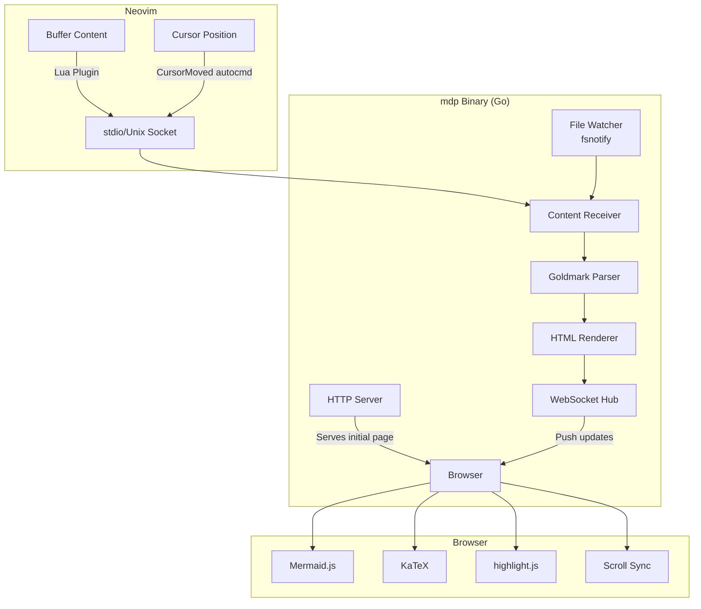
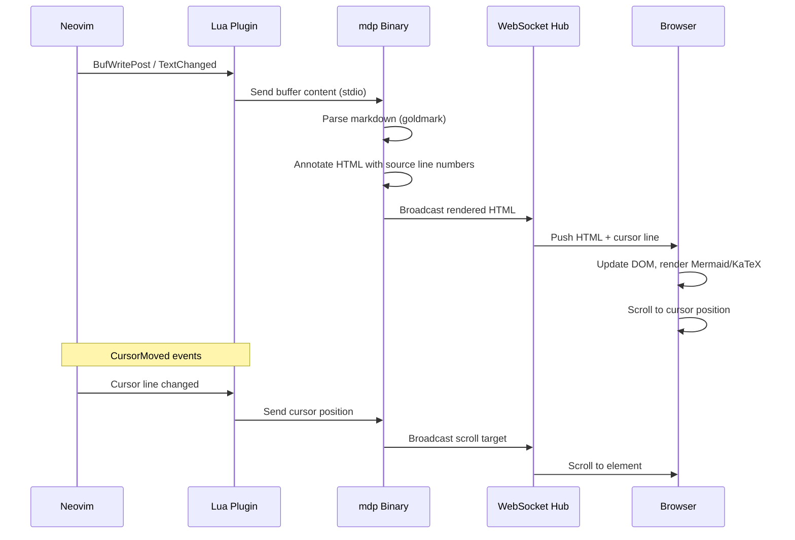
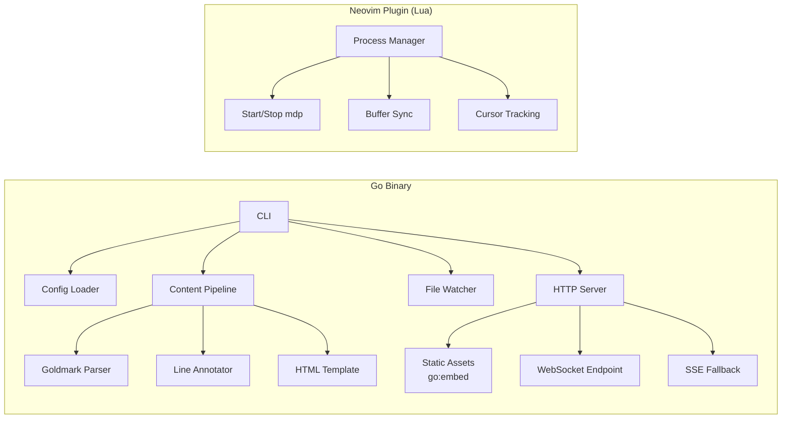
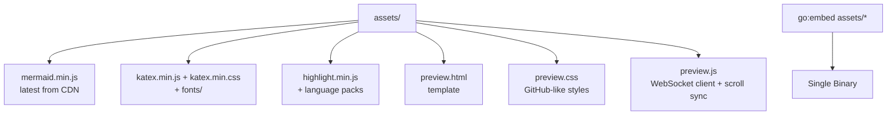

# mdp — Go-Based Markdown Preview for Neovim

## Problem Statement

`markdown-preview.nvim` is the de facto standard for browser-based markdown
preview in Neovim, but it is unmaintained. Its architecture — Neovim RPC →
Node.js server → WebSocket → browser — bundles outdated versions of MermaidJS,
KaTeX, highlight.js, and other rendering libraries. Because nobody is bumping
these dependencies, users get broken or incomplete rendering for modern Mermaid
syntax, math expressions, and code blocks. The Node.js dependency chain also
creates installation friction (yarn/npm build steps that frequently fail) and
adds startup latency.

There is no actively maintained Go-based alternative that provides synchronized
browser preview with live reload for Neovim users.

## Solution

**mdp** is a single Go binary that serves a local HTTP preview of markdown
files, pushed live to the browser via WebSocket/SSE. It follows the same
architectural pattern as Hugo's dev server: the Go binary handles file watching,
markdown parsing, and HTTP serving, while the browser handles all
JavaScript-based rendering (Mermaid, KaTeX, syntax highlighting) at whatever
version is embedded at build time.

The Neovim integration is a thin Lua plugin that manages the binary's lifecycle
and pipes buffer content + cursor position to it.

### Why Go

- Single static binary — no Node.js, no yarn, no npm, no Python
- Fast startup (~5ms vs ~200ms+ for the Node.js approach)
- `go:embed` bundles all client-side JS/CSS assets into the binary, making
  updates a simple version bump and rebuild
- `goldmark` is a battle-tested, CommonMark-compliant parser with a rich
  extension ecosystem
- Hugo has already proven this architecture works at scale

## Architecture

### System Overview



### Data Flow



### Component Responsibilities



### Embedded Asset Strategy

All client-side rendering libraries are embedded into the Go binary at compile
time using `//go:embed`. This is the key architectural decision — it eliminates
runtime dependencies and makes version management trivial.



## Key Design Decisions

### Browser Does the Heavy Lifting

Go parses markdown to HTML server-side via goldmark. All JavaScript-dependent
rendering (Mermaid diagrams, KaTeX math, syntax highlighting) happens
client-side in the browser. This means:

- No headless browser dependency on the server
- No Puppeteer/Playwright for Mermaid rendering
- The browser always has the correct rendering engine available
- Updating a library is just replacing a file in `assets/` and rebuilding

### Scroll Sync via Source Line Annotations

During goldmark's HTML rendering phase, every block-level element gets a
`data-source-line="N"` attribute. When Neovim reports the cursor position, the
browser finds the nearest annotated element and scrolls to it. This is the same
approach used by VS Code's markdown preview and is what makes the preview
genuinely useful vs. just a static render.

### Dual Input Modes

mdp accepts content two ways:

1. **stdio** — The Neovim plugin pipes buffer content directly. This is the
   primary mode for editor integration and enables previewing unsaved changes.
2. **File watching** — `fsnotify` watches the file on disk. This is the fallback
   for standalone CLI usage (`mdp serve README.md`) and for editors without a
   dedicated plugin.

### CLI Interface

```
mdp serve [file]          # Start preview server for a file
mdp serve --port 8080     # Custom port (default: auto-assign)
mdp serve --browser       # Auto-open browser (default: true)
mdp serve --no-browser    # Don't auto-open
mdp serve --theme dark    # Force dark mode
mdp serve --bind 0.0.0.0  # Listen on all interfaces (remote dev)
```

## Go Dependencies

| Package                                   | Purpose                                              |
| ----------------------------------------- | ---------------------------------------------------- |
| `github.com/yuin/goldmark`                | CommonMark markdown parser                           |
| `goldmark/extension`                      | GFM tables, strikethrough, task lists                |
| `go.abhg.dev/goldmark/mermaid`            | Mermaid code block identification (client-side mode) |
| `github.com/yuin/goldmark-highlighting`   | Server-side syntax class annotation                  |
| `github.com/abhinav/goldmark-frontmatter` | YAML/TOML frontmatter parsing                        |
| `github.com/gorilla/websocket`            | WebSocket server                                     |
| `github.com/fsnotify/fsnotify`            | Filesystem watching                                  |
| `github.com/spf13/cobra`                  | CLI framework                                        |

## Embedded Client-Side Libraries

| Library             | Purpose             | Update Strategy                    |
| ------------------- | ------------------- | ---------------------------------- |
| Mermaid.js          | Diagram rendering   | Bump version in `assets/`, rebuild |
| KaTeX               | Math typesetting    | Bump version in `assets/`, rebuild |
| highlight.js        | Syntax highlighting | Bump version in `assets/`, rebuild |
| GitHub Markdown CSS | Base styling        | Maintained in-repo                 |

## Neovim Plugin Interface

The Lua plugin is intentionally minimal — it manages the mdp process lifecycle
and forwards buffer state.

```lua
-- Example LazyVim plugin spec
{
  "yourname/mdp.nvim",
  ft = { "markdown" },
  build = "go install github.com/yourname/mdp@latest",
  keys = {
    { "<leader>mp", "<cmd>MdpToggle<cr>", desc = "Toggle Markdown Preview" },
  },
  opts = {
    port = 0,        -- 0 = auto-assign
    browser = true,
    theme = "auto",  -- follows OS preference
  },
}
```

Commands exposed:

- `:MdpStart` — Start preview server and open browser
- `:MdpStop` — Kill the server
- `:MdpToggle` — Toggle on/off
- `:MdpOpen` — Re-open browser tab without restarting

## Scope Boundaries

### In Scope (MVP)

- Markdown → HTML rendering via goldmark (CommonMark + GFM)
- Live reload via WebSocket on buffer change
- Mermaid diagram rendering (client-side, latest version)
- KaTeX math rendering
- Syntax-highlighted code blocks
- Scroll sync (cursor position → browser scroll)
- Dark/light theme support
- Neovim Lua plugin with LazyVim-compatible spec
- Single binary distribution via `go install`
- Cross-platform (macOS, Linux, Windows)

### In Scope (Post-MVP)

- PlantUML rendering (via public server or local jar)
- Custom CSS injection
- Table of contents sidebar
- Image handling for relative paths
- Export to PDF (via browser print)
- Frontmatter display
- Multiple file preview (tabs)
- Remote development support (SSH forwarding)

### Out of Scope

- In-terminal rendering (use `glow` for that)
- Full Obsidian-flavored markdown compatibility
- Collaborative editing
- Markdown editing features (that's the editor's job)
